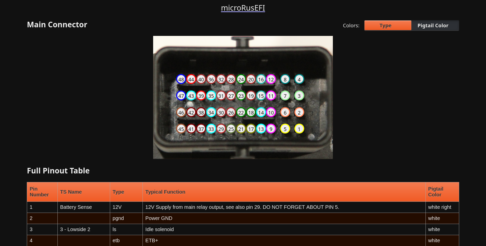

# Interactive Pinout Generator

Example (click to view):  
[](https://rusefi.com/docs/pinouts/microrusefi)

Generating pinouts requires:

- Device connector photo (.jpg)
- Pinout metadata file in [YAML](https://en.wikipedia.org/wiki/YAML) format

Multiple .yaml files within a directory are put into the same index.html page.  
The results will be in a folder named "pinouts".  
If you include the `directory` field within the `info` section of the yaml, the page will be placed within that subdirectory of the "pinouts" directory.  
If none of the .yaml files within a directory have the `directory` field, the `title` field will be used instead.
If none of the .yaml files within a directory have either field, they will be placed in a subdirectory structure matching that from which the action was run.  

Example:  
Suppose you have two .yaml files at `foo/bar/baz/`  
You run the action from `foo/`  
If one or both of the files has the `directory` field set to `quux`, the index.html will be found at `pinouts/quux/index.html`  
If neither file has the `directory` field set, but one or both has the `title` field set to `Magic Board`, the index.html will be found at `pinouts/Magic Board/index.html`  
If neither file has either field set, the index.html will be found at `pinouts/bar/baz/index.html`  

## Syntax of Connector YAML

Each YAML file contains two sections: 'pins' and 'info'

The 'pins' section contains a list of pins, each having the following fields:  

|field   |description|
|--------|-----------|
|pin     |a numeric id corresponding to the physical pin on the connector|
|type    |a short code to allow pins to be grouped and colored by type|

The 'info' section contains information which is used to generate the interactive pinout. It contains the following fields:  

|field    |description|
|---------|-----------|
|cid      |a short name for the connector, to be used in the URL when linking to a particular pin, for pages with more than one connector|
|image    |subsection which contains a single field, 'file', which contains the filename of the image, which is stored in the same directory as the YAML|
|pins     |subsection with a list of the pins' locations on the image. Its fields are 'pin', which matches to an 'id' in the main 'pins' section, 'x' and 'y', which are the coordinates on the image|
|title    |the title for the page. Only one connector for a particular board needs this field|
|directory|the target directory for the page. Only one connector for a particular board needs this field|
|board_url|a URL for documentation, which will be placed as a link on the top of the page. Only one connector for a particular board needs this field|
|name     |a human-readable name for the connector|
|order    |an index to order the connectors on the page. The lower the number, the nearer the top of the page. If the 'order' field is not present, order is undefined, but will probably be sorted alphabetically by the file name|

### Example YAML

You can find the YAML files that generated the example image above [at this link](https://github.com/rusefi/rusefi/tree/master/firmware/config/boards/microrusefi/connectors).

```
pins:
  - pin: 1
    type: 12V
    function: 12V Supply from main relay output

  - pin: 2
    type: pgnd
    function: Power GND

  - pin: 3
    type: ls
    function: Idle solenoid

  - pin: 4
    type: etb
    function: ETB+

info:
  title: Big Magic Box
  directory: big_magic
  name: Main Connector
  board_url: https://example.com/documentation
  cid: c1
  image:
    file: connector.jpg
  pins:
    - pin: 1
      x: 1508
      y: 958
    - pin: 2
      x: 1508
      y: 787
    - pin: 3
      x: 1508
      y: 616
    - pin: 4
      x: 1508
      y: 445
```

## Using this Action in Your Workflow

### Handling Warnings

There is a `warnings` option to set how warnings are handled, and more options to give finer control over certain types of warnings.
|field|trigger|
|-----|-------|
|`warning-no-cid`|A missing `cid` field in the `info` section|
|`warning-no-image`|A missing `file` field in the `image` subsection of the `info` section|
|`warning-dupe`|More than one pin that share the same `pin` field in a single mapping|

### Example Workflow Step

For a real-life example, [see how rusEFI](https://github.com/rusefi/rusefi/blob/master/.github/workflows/gen-pinouts.yaml) uses interactive-pinouts in Github Actions.

```
- name: Generate Pinouts
  uses: chuckwagoncomputing/interactive-pinout
  with:
    mapping-path: ./firmware/config/boards/*/connectors/*.yaml
    warnings: skip
    columns: |
      {
      "pin":"Pin Number",
      "ts_name":"TS Name",
      "type":"Type",
      "function":"Typical Function",
      "color":"Pigtail Color"
      }
    print-columns: |
      [
      "function"
      ]
    colors: |
      {
      "12v":"yellow";
      "12V":"yellow";
      "5v":"red",
      "5V":"red",
      "at":"green",
      "av":"brown",
      "can":"blue",
      "din":"lime",
      "etb":"darkcyan",
      "gnd":"darkgreen",
      "gp_high":"aqua",
      "gp_low":"aquamarine",
      "gp_pp":"cyan",
      "hall":"darkolivegreen",
      "hl":"gold",
      "hs":"indigo",
      "ign":"magenta",
      "inj":"maroon",
      "ls":"lightgreen",
      "mr":"firebrick",
      "pgnd":"coral",
      "sgnd":"olive",
      "usb":"lightseagreen",
      "vr":"sienna"
      }
```

## Using as a stand-alone script, without Github Actions

The parameters in the workflow can also be passed to main.sh as environment variables instead.
Here is the complete list of variables:

```
MAPPING_PATH
WARNINGS
WARNING_NO_CID
WARNING_NO_IMAGE
WARNING_DUPE
COLS
PRINT_COLS
COLORS
DEBUG
```

After exporting these environmnet variables, execute main.sh.
Example:

```
$ export MAPPING_PATH="./firmware/config/boards/*/connectors/*.yaml"
$ export WARNINGS="skip"
$ export COLS='{"pin":"Pin Number","ts_name":"TS Name","type":"Type","function":"Typical Function","color":"Pigtail Color"}'
$ export PRINT_COLS='["function"]'
$ export COLORS='{"12v":"yellow";"12V":"yellow";"5v":"red","5V":"red","at":"green","av":"brown","can":"blue","din":"lime","etb":"darkcyan","gnd":"darkgreen","gp_high":"aqua","gp_low":"aquamarine","gp_pp":"cyan","hall":"darkolivegreen","hl":"gold","hs":"indigo","ign":"magenta","inj":"maroon","ls":"lightgreen","mr":"firebrick","pgnd":"coral","sgnd":"olive","usb":"lightseagreen","vr":"sienna"}'
$ bash ../interactive-pinout/main.sh
```
